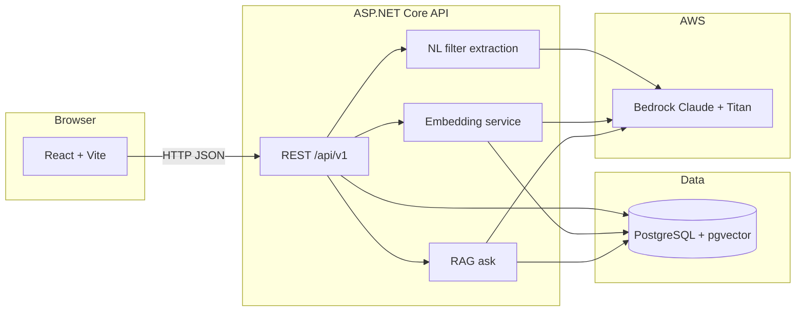

# Real Estate AI Agent

Portfolio project: **React + TypeScript** frontend, **ASP.NET Core** API, **PostgreSQL** with **pgvector**, and **AWS Bedrock** (Claude chat + Titan embeddings) for natural-language search, hybrid retrieval, and RAG Q&A over a small property catalog.

This is a learning/demo codebase—not production-hardened.

---

## Architecture



**Flow (Phase 5):**

1. **Structured search** — filters on city, beds, price, garage (`GET /api/v1/properties`).
2. **NL search** — Bedrock extracts filters → same SQL search (`POST /api/v1/ai/search`).
3. **Semantic search** — embed query → nearest neighbors on `DescriptionEmbedding` (`POST /api/v1/ai/semantic-search`).
4. **Hybrid search** — semantic + filter search merged with reciprocal rank fusion (`POST /api/v1/ai/hybrid-search`).
5. **RAG ask** — retrieve top‑k listings by embedding, answer with Claude using only that context (`POST /api/v1/ai/ask`).

---

## Repository layout

```
real-estate-ai-agent/
├── frontend/          # React + TypeScript + Vite
├── backend/           # RealEstateAiAgent.Api + tests
└── docs/              # (optional notes)
```

---

## Prerequisites

- **Node.js** 20.19+ or 22.12+ (for Vite)
- **.NET SDK** 10
- **Docker Desktop** (Postgres + pgvector)
- **AWS CLI** configured with permission to **Bedrock** (`InvokeModel` for chat + Titan embeddings)

---

## How to run

### 1. PostgreSQL (Docker + pgvector)

If port **5432** is already used locally, map host **5433** → container **5432** (example below).

```powershell
docker run -d --name rea-postgres `
  -e POSTGRES_USER=postgres `
  -e POSTGRES_PASSWORD=YOUR_PASSWORD `
  -e POSTGRES_DB=real_estate_ai_agent `
  -p 5433:5432 `
  pgvector/pgvector:pg17
```

Enable the extension (once):

```powershell
docker exec -it rea-postgres psql -U postgres -d real_estate_ai_agent -c "CREATE EXTENSION IF NOT EXISTS vector;"
```

### 2. API configuration

From `backend/RealEstateAiAgent.Api`:

```powershell
cd backend/RealEstateAiAgent.Api
dotnet user-secrets set "ConnectionStrings:DefaultConnection" "Host=localhost;Port=5433;Database=real_estate_ai_agent;Username=postgres;Password=YOUR_PASSWORD"
```

Configure **Bedrock** in `appsettings.json` / User Secrets (`Bedrock:ModelId`, region, etc.) and ensure model access in the AWS account.

Apply migrations and seed (Development):

```powershell
dotnet ef database update
dotnet run
```

API listens on **http://localhost:5134** (see `Properties/launchSettings.json`).

**Embeddings (dev):** After the API is up, backfill listing vectors once:

```powershell
Invoke-RestMethod -Method Post -Uri 'http://localhost:5134/api/v1/ai/embeddings/backfill'
```

### 3. Frontend

```powershell
cd frontend
npm install
npm run dev
```

Open **http://localhost:5173**. The Vite config defaults `VITE_API_BASE_URL` to `http://localhost:5134`; override with a `.env` file if needed:

```env
VITE_API_BASE_URL=http://localhost:5134
```

---

## Example API calls (PowerShell)

Use single-quoted JSON bodies to avoid escaping issues.

**Hybrid search** (filters + semantic, merged ranking):

```powershell
$body = '{"query":"San Jose 2 bed walkable to transit under 900k","limit":5}'
Invoke-RestMethod -Method Post -Uri 'http://localhost:5134/api/v1/ai/hybrid-search' `
  -ContentType 'application/json' -Body $body
```

**Semantic search** (vector similarity only):

```powershell
$body = '{"query":"walkable to transit downtown loft","limit":5}'
Invoke-RestMethod -Method Post -Uri 'http://localhost:5134/api/v1/ai/semantic-search' `
  -ContentType 'application/json' -Body $body
```

**RAG ask** (retrieved listings + grounded answer):

```powershell
$body = '{"question":"Which homes are walkable to transit in downtown San Jose?","topK":5}'
Invoke-RestMethod -Method Post -Uri 'http://localhost:5134/api/v1/ai/ask' `
  -ContentType 'application/json' -Body $body
```

Swagger UI (Development): **http://localhost:5134/swagger**

---

## Tests

```powershell
cd backend
dotnet test

cd ../frontend
npm test
```

---

## License

Portfolio / educational use unless otherwise noted.
